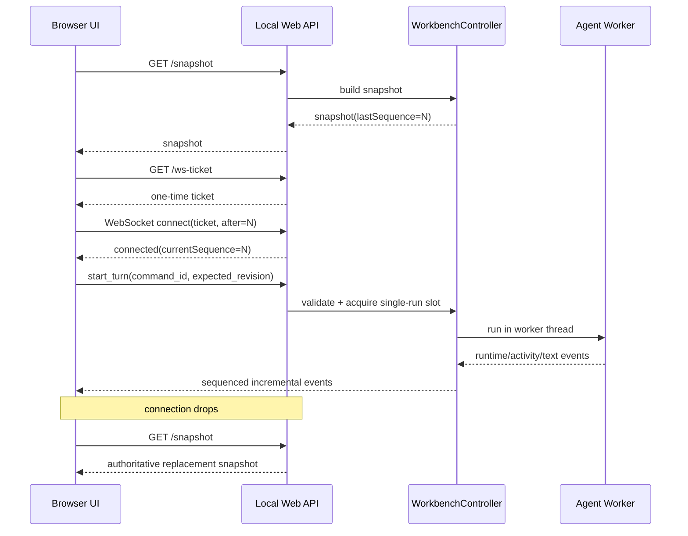

# Neil Agent Web Workbench 开发文档

> 状态：P0 implemented · Draft v0.2
>
> 更新时间：2026-08-13
>
> 适用范围：Neil-Agent 本地 Web 前端、Web 适配层与相关测试
>
> 参考界面：用户提供的 1584 × 992 桌面端设计图

## 1. 文档目的

本文档定义 Neil-Agent Web Workbench 的产品范围、界面结构、视觉规范、前后端边界、实时协议、安全要求、实施阶段和验收标准。它是后续原型、接口和实现评审的共同基线，不代表当前仓库已经具备全部能力。

参考图最值得保留的是清晰的职责分区：

- 左侧用于项目与会话导航；
- 中间用于呈现 Agent 的目标、执行步骤和结果；
- 右侧用于检查、变更与审批；
- 底部用于输出或受控终端；
- 顶部用于工作区、模式、模型和运行状态等全局上下文。

实现目标是复现这套信息架构与交互层级，而不是逐像素复制一张静态图片。页面显示的数据必须来自 Neil-Agent 的真实状态或明确标注的开发 fixture，不能由 UI 猜测。

## 2. 当前仓库基线

Neil-Agent 当前是 Python 3.13、`uv`、Rich 与 Textual 构成的本地 Agent/CLI 项目，尚无浏览器前端，也没有 Node 工具链。

已有且应复用的领域能力如下：

| 领域 | 当前实现 | Web Workbench 用法 |
| --- | --- | --- |
| Agent 执行 | `Agent.stream_chat()` | 由 Web 运行控制器在后台线程执行，浏览器不能直接调用 Agent 对象 |
| 运行事件 | `RuntimeEvent`、`EventBus` | 作为实时状态的事实来源，继续保持有界和元数据脱敏 |
| 执行投影 | `ExecutionGraphProjector`、`TimelineProjector`、`MetricsProjector` | 转换为版本化 Web DTO，驱动时间线和指标 |
| 高层活动 | `ActivityEvent` | 驱动用户可读的步骤描述；与元数据事件关联后展示 |
| 计划与检查 | `TaskTracker`、`QualityCheckRecord` | 驱动 Plan、Test 和 Review 状态 |
| 会话 | `SessionStore`、`SessionSummary` | 驱动 Sessions 列表和恢复操作 |
| 上下文 | `ContextTomography`、`TokenUsage` | 驱动 Context 仪表和用量说明 |
| 审批 | 现有逐工具预览与审批流程、`ApprovalFlowProjector` | Web 端继续逐工具、精确绑定、默认拒绝 |
| 安全 | `SecurityShield`、工作区边界、Git 固定工具 | 驱动安全状态，不在 Web 层绕过现有策略 |
| Git | `ShellTools` 的只读状态与 diff | 新增受限 DTO 适配，不向浏览器开放任意 Git 命令 |

参考图中的以下能力当前不存在，必须按阶段新增，不能仅靠前端模拟为“已实现”：

- 浏览器文件树与文件变化监听；
- 每个变更文件的 `+/-` 行统计和可选择的 diff 查看；
- 浏览器实时传输、事件游标、重连与快照重同步；
- Focus/Build 的正式业务语义；
- Provider 价格表和美元成本估算；
- 一次性“Approve & Apply”整批变更事务；
- 任意交互式 shell/PTY；
- 展示完整工具参数、工具结果或模型 thinking 的内容通道。

## 3. 产品目标与非目标

### 3.1 首个可用版本目标

1. 在桌面浏览器中呈现项目、会话、执行时间线、上下文、检查和审批状态。
2. 能启动单个 Agent turn、查看流式回答、取消当前 turn，并在断线后恢复最新快照。
3. 沿用现有逐工具审批语义，审批预览在服务端再次校验后才执行。
4. 在不泄露 prompt、thinking、密钥、完整工具正文的前提下呈现有用的运行反馈。
5. 在 1440 px 以上完整还原参考图的三栏工作台体验，并为较窄窗口提供抽屉式降级。
6. 保持 CLI、Textual TUI 和非交互协议的行为兼容。

### 3.2 非目标

首版不包含：

- 云端部署、多人协作、跨机器同步或账号系统；
- 浏览器中编辑任意文件的完整 IDE；
- 未经现有工具注册表和审批边界的文件或 Git 操作；
- 任意命令终端、远程 shell 或浏览器到 PTY 的直通连接；
- thinking/reasoning 正文展示；
- 将 token 用量伪装成精确费用；
- 把多个独立工具批准合并成不具备原子性的“最终应用”。

## 4. 关键产品决策

### 4.1 桌面优先、本地优先

Workbench 是本地开发工具，服务端默认只绑定 `127.0.0.1`。完整布局优先面向 1440 px 及以上桌面窗口；移动端只保证查看、取消和审批等有限操作，不承诺完整 IDE 体验。

### 4.2 页面只消费稳定 DTO

浏览器不能序列化或依赖 `Agent`、`SessionStore`、`ToolCall` 等内部对象。Python Web 适配层负责把领域模型投影为带版本号的 DTO，并对所有输入做严格校验。这样可以避免 Web 和 Textual 两套 UI 各自定义一套状态语义。

### 4.3 快照 + 增量事件

HTTP 提供首屏快照和重同步；WebSocket 提供双向命令与增量事件。浏览器的状态必须能随时由最新快照重建，不能依赖永不丢失的长连接。

### 4.4 单工作区、单活动 turn

首版每个服务进程只管理一个工作区，并且最多允许一个活动 Agent turn。重复提交返回冲突，不进入隐式排队。多浏览器标签页可以观察同一运行，但只有持有当前控制租约的客户端能发起取消或审批。

### 4.5 审批保持逐工具语义

参考图中的 `Approve & Apply` 在首版改为当前高风险工具的 `Approve`。审批必须绑定工具名、参数摘要、预览摘要、工作区和时效；服务端在执行前复核绑定，发生变化时失败关闭。`Request changes` 首版等价于拒绝当前工具并向该次 turn 返回清晰的拒绝结果，不悄悄开启新一轮模型调用。

### 4.6 “Terminal”分阶段实现

P0–P3 底部区域使用同样的布局，但产品名称为 `Output`，只显示 Agent 流式回答、ActivityEvent 和受控质量检查输出。只有在后续完成独立安全评审、进程生命周期、环境变量白名单、尺寸上限、退出和审计机制后，才可以改名为 `Terminal` 并接入 PTY。

## 5. 信息架构与页面布局

### 5.1 页面区域

```text
┌──────────────────────────────── GlobalHeader ────────────────────────────────┐
│ Brand | Workspace | Focus/Build | Model | Agent status | User/menu          │
├──────────── ProjectSidebar ────────────┬──────── AgentWorkspace ─────┬ ReviewPanel ┤
│ Project tree                           │ Objective                   │ Checks      │
│ Sessions                               │ Run timeline                │ Changes     │
│ Settings                               │ Step details                │ Context     │
│                                        │                             │ Approval    │
├────────────────────────────────────────┴─────────────────────────────┴─────────────┤
│                              OutputPanel                                       │
└────────────────────────────────────────────────────────────────────────────────┘
```

五个稳定区域：

1. `GlobalHeader`：品牌、工作区、模式、模型、运行状态和菜单。
2. `ProjectSidebar`：项目文件树、会话历史和设置入口。
3. `AgentWorkspace`：任务目标、Agent 执行时间线和流式总结。
4. `ReviewPanel`：检查、变更、上下文、估算与审批。
5. `OutputPanel`：输出、质量检查和未来的受控终端入口。

### 5.2 桌面网格

建议起始值：

```css
.app-shell {
  display: grid;
  grid-template:
    "header header header" 72px
    "sidebar workspace review" minmax(0, 1fr)
    "sidebar output output" var(--output-height)
    / 288px minmax(640px, 1fr) 376px;
  gap: 18px;
  min-height: 100dvh;
  padding: 20px 28px 26px;
}
```

- `--output-height` 默认 `168px`，用户可在 `160px` 到 `45vh` 之间拖拽。
- 中央栏负责吸收宽度；不允许代码块或长路径撑破网格。
- 面板内部独立滚动，页面本身不产生不可控的双重滚动。
- 参考图的终端从左侧设置按钮右边开始；实现中底部面板与主内容对齐，侧栏继续保持自己的底部设置区。

### 5.3 推荐组件树

```text
WebWorkbenchApp
├─ GlobalHeader
│  ├─ Brand
│  ├─ WorkspaceSelector
│  ├─ ModeSwitcher
│  ├─ ModelSelector
│  ├─ RunStatus
│  └─ AppMenu
├─ ProjectSidebar
│  ├─ FileTree
│  │  └─ FileTreeNode (recursive)
│  ├─ SessionList
│  │  └─ SessionListItem
│  └─ SettingsButton
├─ AgentWorkspace
│  ├─ ObjectiveBar
│  └─ RunTimeline
│     └─ TimelineStep
│        ├─ StepHeader
│        ├─ StepDetails
│        ├─ CodePreview
│        ├─ PlanPreview
│        └─ TestResult
├─ ReviewPanel
│  ├─ CurrentCheck
│  ├─ ChangedFileList
│  ├─ ContextUsage
│  ├─ CostEstimate
│  └─ ApprovalCard
└─ OutputPanel
   ├─ OutputToolbar
   ├─ OutputStream
   └─ OutputControls
```

`TimelineStep` 必须由统一数据模型驱动，不能为 Search、Read File、Plan、Edit File、Test 分别硬编码一套状态逻辑。

## 6. 交互与状态模型

### 6.1 Agent 状态

```text
offline -> connecting -> idle -> running -> waiting_for_approval
                              \-> completed -> idle
                              \-> failed ----> idle
                              \-> cancelled -> idle
```

允许的 UI 状态：

- `offline`：本地服务不可达；
- `connecting`：正在获取快照或重连；
- `idle`：可以发起 turn；
- `running`：模型或工具正在执行；
- `waiting_for_approval`：等待当前控制客户端审批；
- `completed`、`failed`、`cancelled`：终态摘要，随后回到 idle。

`offline` 和 `connecting` 是客户端连接状态，其余是服务端运行状态。实现中应分别建模为 `connectionStatus` 与 `runStatus`；上图只是页面可见状态的合并示意，不能把网络重连写入 Agent 运行状态机。

浏览器不根据最后一条文字消息推断状态；状态由服务端快照和事件明确给出。

### 6.2 时间线步骤状态

- `pending`
- `running`
- `waiting_for_approval`
- `succeeded`
- `failed`
- `skipped`
- `cancelled`

现有 `RuntimeStatus` 没有 `cancelled`。Web DTO 可以在 turn 级别表达取消，但在核心领域事件扩展并完成向后兼容之前，不应伪造一个新的持久化 RuntimeEvent 状态。

### 6.3 Review 状态

- `empty`：无变更；
- `checking`：质量检查运行中；
- `passed`：最新检查通过；
- `failed`：最新检查失败；
- `approval_required`：存在待审批工具；
- `stale`：变更或预览在检查后发生变化；
- `applied`：具体工具已批准并成功执行。

`passed` 不等于“安全应用所有变更”，`applied` 也不等于 Git 已暂存或提交。

### 6.4 关键交互规则

- 文件树支持展开、折叠、选择和方向键导航；符号链接和工作区外路径不跟随。
- 切换会话前，如果存在活动 turn 或待审批请求，需禁用切换并说明原因。
- 时间线步骤可展开安全详情；默认只显示经过清洗的摘要。
- 点击变更文件打开只读 diff；文件选择状态在 Review 与主区同步。
- 只有存在有效待审批请求时才启用 Approve/Reject。
- 用户向上滚动时间线后暂停自动跟随；回到底部或点击“Follow live”才恢复。
- Output 支持折叠、拖拽高度和复制选中内容；不能执行任意命令。
- 模型或模式切换只允许在 idle 状态进行，并明确作用于下一次 turn。
- 所有服务端副作用命令必须携带唯一 `command_id`，重复提交不能重复执行。

## 7. 视觉设计规范

### 7.1 设计原则

- 深色、低饱和、玻璃质感，但文字和代码对比度优先。
- 发光用于当前 Agent 节点和少量成功反馈，不作为唯一状态表达。
- 统一使用线性图标；不混用 emoji、填充图标和不同描边体系。
- 视觉层级服务于“当前在做什么、改了什么、是否安全、是否需要我操作”。

### 7.2 基础设计令牌

```css
:root {
  color-scheme: dark;

  --color-bg: #171d21;
  --color-bg-deep: #11171b;
  --color-surface-1: rgba(46, 53, 58, 0.82);
  --color-surface-2: rgba(35, 42, 47, 0.88);
  --color-surface-solid: #293035;
  --color-border: rgba(255, 255, 255, 0.20);
  --color-border-subtle: rgba(255, 255, 255, 0.11);

  --color-text: #f3f5f4;
  --color-text-muted: #bbc1c3;
  --color-text-faint: #8e979b;

  --color-accent: #9cdf68;
  --color-added: #a0e66c;
  --color-deleted: #f07a48;
  --color-warning: #e7c56b;
  --color-danger: #f16f6f;
  --color-focus: #b8e48e;

  --radius-panel: 20px;
  --radius-control: 999px;
  --space-1: 4px;
  --space-2: 8px;
  --space-3: 12px;
  --space-4: 16px;
  --space-5: 24px;
  --space-6: 32px;

  --output-height: 168px;
  --motion-fast: 120ms;
  --motion-base: 200ms;
}
```

### 7.3 字体和尺寸

- UI 字体：`Inter, Geist, "Segoe UI", system-ui, sans-serif`；
- 代码字体：`"JetBrains Mono", "Cascadia Code", Consolas, monospace`；
- 正文：14–16 px；
- 辅助文字：12–13 px；
- 面板标题：18–20 px；
- 工具步骤图标：44–46 px；
- 点击目标最小：44 × 44 px；
- 面板内边距：20–24 px；
- 时间线轨道：1–2 px。

字体资源首版优先使用本机字体栈，避免首次启动依赖公网字体 CDN。

### 7.4 玻璃效果与降级

```css
.panel {
  background: var(--color-surface-1);
  border: 1px solid var(--color-border);
  border-radius: var(--radius-panel);
  backdrop-filter: blur(18px);
}

@supports not (backdrop-filter: blur(1px)) {
  .panel { background: var(--color-surface-solid); }
}
```

大面积模糊不能降低代码可读性；低性能模式和 `prefers-reduced-transparency` 等可用信号下使用实色表面。

## 8. 响应式与可访问性

### 8.1 响应式断点

| 视口宽度 | 布局策略 |
| --- | --- |
| `>= 1440px` | 完整三栏；左栏 288 px，右栏 376 px |
| `1024–1439px` | 左栏可收窄/折叠，右栏最小 320 px |
| `768–1023px` | 中央区全宽；文件树和 Review 变为左右抽屉；P0 的 Output 保持可折叠底栏，P1 再评估独立底部抽屉 |
| `< 768px` | 只保证查看、取消和审批；隐藏次级统计与非关键时间戳 |

必须验证：200% 浏览器缩放、中文长任务、超长路径、长模型名、空状态、大量时间线节点和 320 px 宽窄屏。

### 8.2 可访问性要求

目标至少为 WCAG 2.2 AA：

- 使用 `header`、`nav`、`main`、`aside`、`section` 等语义区域；
- 文件树使用 `role="tree"`、`treeitem` 和 `aria-expanded`；
- ModeSwitcher 根据实际语义使用 tabs 或 radiogroup，并支持方向键；
- Context 仪表提供 `role="progressbar"`、当前值、最大值和可见文本；
- 状态同时使用图标、文字和颜色；
- 流式状态使用克制的 `aria-live="polite"`，不持续朗读整个 Output；
- 所有图标按钮有可访问名称；
- 可见焦点环至少 2 px，不能只靠发光；
- 抽屉和弹层支持 Escape、焦点圈定和关闭后的焦点归还；
- 支持 `prefers-reduced-motion`，关闭脉冲、流光和大幅位移动画；
- 时间戳使用 `<time datetime="...">`；
- 增删行统计向屏幕阅读器提供“增加 N 行、删除 N 行”的完整文本。

## 9. 推荐技术方案

### 9.1 前端

- React + TypeScript；
- Vite 构建和本地开发；
- CSS Modules 或原生 CSS cascade layers + CSS variables；
- 状态分为服务端快照/事件状态和纯 UI 状态；
- 图标使用单一线性图标库；
- 单元/组件测试使用 Vitest + Testing Library；
- 浏览器端到端和视觉回归使用 Playwright。

React 组件化和 TypeScript 类型边界适合这类多区域状态 UI；Vite 提供 React/TypeScript 模板和快速开发构建。Vite 只转译 TypeScript，不执行完整类型检查，因此 CI 必须单独运行 `tsc --noEmit`。实现时以官方文档为准：

- [React：Using TypeScript](https://react.dev/learn/typescript)
- [Vite：Getting Started](https://vite.dev/guide/)
- [Vite：Features / TypeScript](https://vite.dev/guide/features.html#typescript)

不在本阶段锁死具体大版本；脚手架 PR 必须提交 `package.json`、锁文件、Node 版本约束和依赖选择记录。

### 9.2 Python Web 适配层

建议新增 FastAPI/Starlette + Uvicorn 作为本地服务层：

- HTTP：健康检查、bootstrap、快照、只读资源；
- WebSocket：运行命令、审批、取消、增量事件；
- Pydantic：请求、响应和事件 DTO；
- Agent 同步执行放入专用后台线程；async event loop 不直接运行阻塞模型流；
- 一个 `WorkbenchController` 统一所有入口，CLI/TUI 的领域逻辑不复制到路由函数。

FastAPI 支持 WebSocket 收发 JSON、依赖注入和 TestClient 测试。参考：

- [FastAPI：WebSockets](https://fastapi.tiangolo.com/advanced/websockets/)
- [FastAPI：Testing WebSockets](https://fastapi.tiangolo.com/advanced/testing-websockets/)

### 9.3 为什么不采用纯静态前端或仅 SSE

- 纯静态前端无法安全访问本地 Agent、会话、Git 和审批能力；
- SSE 适合单向事件，但提交 prompt、取消、获取控制权和审批仍需要另一套命令通道；
- WebSocket 可承载双向命令和事件，但仍需 HTTP 快照作为重连基线。

## 10. 推荐目录结构

```text
Neil-Agent/
├─ src/neil_agent/
│  ├─ web/
│  │  ├─ __init__.py
│  │  ├─ app.py                 # 应用工厂、路由装配、静态资源挂载
│  │  ├─ controller.py          # 单活动 turn、控制租约、取消与审批编排
│  │  ├─ dto.py                 # 版本化 Pydantic DTO
│  │  ├─ projections.py         # 领域对象 -> Web DTO
│  │  ├─ protocol.py            # 命令、事件 envelope 和错误码
│  │  ├─ security.py            # Origin、bootstrap token、host/路径校验
│  │  └─ resources.py           # 文件树、Git review 的只读适配
│  └─ ...                       # 现有 Agent 领域代码
├─ web/
│  ├─ src/
│  │  ├─ app/
│  │  ├─ components/
│  │  ├─ features/
│  │  │  ├─ workspace/
│  │  │  ├─ sessions/
│  │  │  ├─ timeline/
│  │  │  ├─ review/
│  │  │  └─ output/
│  │  ├─ protocol/
│  │  ├─ styles/
│  │  └─ test/
│  ├─ package.json
│  ├─ tsconfig.json
│  └─ vite.config.ts
├─ tests/web/
├─ tests/e2e/
└─ docs/web-workbench-development.md
```

生产构建可将 `web/dist` 打包为 Python wheel 资源，但开发阶段保持前后端进程分离和显式代理配置。

## 11. Web 协议设计

### 11.1 版本化 envelope

所有 WebSocket 消息使用统一 envelope：

```json
{
  "protocol_version": 1,
  "message_type": "event",
  "message_id": "msg_01...",
  "sequence": 1042,
  "timestamp": "2026-08-13T10:28:00.000Z",
  "payload": {}
}
```

约束：

- `protocol_version` 不兼容时明确拒绝；
- 服务端事件 `sequence` 在当前进程内单调递增；
- 客户端命令带 `command_id`，服务端保存有界去重窗口；
- 所有字符串、列表和嵌套层级都有上限；
- 未知字段默认拒绝，避免静默接受错误命令；
- 错误使用稳定 `error_code`，不把内部异常堆栈发送到浏览器。

### 11.2 HTTP 端点

| 方法 | 路径 | 用途 | 副作用 |
| --- | --- | --- | --- |
| `GET` | `/api/v1/health` | 服务状态与协议版本 | 无 |
| `POST` | `/api/v1/bootstrap` | 交换一次性启动凭据，建立 HttpOnly 会话 | 创建本地 UI 会话 |
| `GET` | `/api/v1/snapshot` | 完整可重建快照 | 无 |
| `GET` | `/api/v1/sessions` | 有界分页会话列表 | 无 |
| `GET` | `/api/v1/files/tree` | 工作区内有界文件树 | 无 |
| `GET` | `/api/v1/review` | Git 状态、文件统计和检查摘要 | 无 |
| `GET` | `/api/v1/review/diff?path=...` | 单文件有界只读 diff | 无 |
| `GET` | `/api/v1/ws-ticket` | 生成短时、单次 WebSocket ticket | 创建临时凭据 |
| `WS` | `/api/v1/events?ticket=...` | 命令和实时事件 | 取决于命令 |

不要把长期 secret 放在 URL 查询参数中。WebSocket ticket 必须短时、单次消费，且服务端日志不记录其原文。

### 11.3 快照 DTO

```ts
interface WorkbenchSnapshotV1 {
  version: 1;
  generatedAt: string;
  workspace: WorkspaceSummary;
  model: ModelSummary;
  run: RunSummary;
  sessions: SessionPage;
  timeline: TimelineStepDto[];
  review: ReviewSummary;
  context: ContextSummary;
  security: SecuritySummary;
  output: OutputSnapshot;
  capabilities: WorkbenchCapabilities;
  lastSequence: number;
}
```

`capabilities` 明确告诉前端哪些操作真实可用，例如 `canStartTurn`、`canApproveTool`、`canShowDiff`、`canEstimateCost`、`hasPty`。前端通过能力控制可见性和禁用状态，不通过版本号猜测。

### 11.4 客户端命令

首版命令：

```text
acquire_control
release_control
start_turn
cancel_turn
approve_tool
reject_tool
select_session
set_model_for_next_turn
ping
```

每条命令包含：

```json
{
  "protocol_version": 1,
  "message_type": "command",
  "command_id": "cmd_01...",
  "expected_revision": 27,
  "command": "cancel_turn",
  "payload": { "run_id": "run_01..." }
}
```

`expected_revision` 用于拒绝针对旧快照的危险操作。只读操作不需要通过 WebSocket 命令发送。

### 11.5 服务端事件

建议事件类型：

```text
snapshot_invalidated
control_changed
command_accepted
command_rejected
run_started
run_status_changed
timeline_step_upserted
assistant_text_delta
activity_added
approval_requested
approval_resolved
review_updated
context_updated
session_updated
output_appended
run_finished
protocol_error
```

`assistant_text_delta` 和 `output_appended` 必须带所属 `run_id`、流 ID、offset 或 chunk sequence，以便检测缺块。发现间隙后前端停止拼接并重新获取快照。

每个命令先返回带原始 `command_id` 的 `command_accepted` 或 `command_rejected`；接受只表示通过校验并进入处理，不代表副作用已经成功。最终结果由对应的领域事件表达。

### 11.6 重连流程



EventBus 是有界的，观察者可能丢事件。因此 Web 层必须把“发生丢失”转换成 `snapshot_invalidated`，而不是继续展示可能错误的局部状态。

## 12. 数据映射与缺口

| UI 区域 | 真实来源 | 首版处理 | 后续缺口 |
| --- | --- | --- | --- |
| 模型选择 | `Settings` / Provider 描述 | idle 时选择下一 turn 模型 | 等 Provider runtime 配置收口 |
| Running 状态 | Controller + Agent turn | 明确状态机 | 无 |
| Sessions | `SessionStore` | 分页只读、idle 时恢复 | 搜索/虚拟列表优化 |
| 时间线 | RuntimeEvent 投影 + ActivityEvent | 元数据与安全摘要 | 事件/活动稳定关联 ID |
| 计划 | `TaskTracker.steps` | 只读展示 | 计划编辑不在首版 |
| Test | `QualityCheckRecord` | 展示命令名、状态和有界输出 | 多检查历史 |
| Changed files | Git porcelain/diff numstat 的新只读适配 | 有界列表和统计 | rename/conflict/submodule 完整语义 |
| Context | `ContextTomography` + `TokenUsage` | 显示本地估算与服务端实测的区别 | Provider 上下文上限元数据 |
| Cost | 无 | 显示 unavailable，不显示 `$0.00` | 版本化费率表和缓存 token 规则 |
| Approval | 现有逐工具审批 | 单请求 Approve/Reject | 不承诺 aggregate apply |
| Terminal | 无 PTY | Output 面板 | 独立安全设计后再评估 |
| 文件树 | 无专用 API | 新增只读、有界资源适配 | watcher 与增量刷新 |

### 12.1 内容边界

现有 RuntimeEvent 故意只包含元数据。Web 端需要的代码片段、diff 或质量检查输出必须走独立的、有界的、用途明确的 DTO：

- diff 只由 Git 只读命令生成；
- 文件片段必须经过工作区路径校验、大小上限和二进制检测；
- 工具参数与工具结果默认不返回；
- thinking、Provider 私有 reasoning state、API Key、环境变量、`AGENTS.md` 正文永不通过 UI 事件返回；
- 浏览器错误日志不得包含审批预览、prompt 或完整路径敏感内容。

## 13. 安全模型

本地 Web 服务并不因绑定 localhost 自动安全。恶意网页可能利用浏览器访问本机服务，因此必须同时落实以下控制：

1. 默认只绑定 `127.0.0.1`，不使用 `0.0.0.0`；远程绑定需要独立显式选项和威胁评审。
2. 启动时生成高熵 bootstrap secret，通过本地启动流程交给浏览器；交换后使用 `HttpOnly`、`SameSite=Strict` 会话 cookie。
3. 校验 `Host` 与 `Origin`；CORS 默认关闭，不使用通配符。
4. 所有改变状态的 HTTP 请求校验 CSRF；副作用优先走已认证 WebSocket 命令。
5. WebSocket 使用短时单次 ticket，并在连接后绑定本地会话和控制租约。
6. 控制租约同一时间只授予一个客户端；失联后短时过期，待审批默认拒绝。
7. 所有路径先解析并验证仍位于工作区内；拒绝符号链接逃逸、设备文件和不可接受的重解析点。
8. 文件树、diff、输出、事件缓冲和请求体均设置数量与字节上限。
9. 页面设置严格 CSP，静态资源本地提供，不加载远程脚本、字体或分析 SDK。
10. 日志只记录有界元数据；认证 token、prompt、thinking、审批预览和工具正文不落日志。
11. 浏览器永远不能提交原始 shell 字符串绕过 `ToolRegistry`、`ShellTools` 或 sandbox 策略。
12. 服务退出、控制客户端断线或 revision 不匹配时，所有待审批请求失败关闭。

bootstrap secret 不能作为普通命令行参数传递，以免进入进程列表或 shell history。优先通过仅当前用户可读的临时文件、标准输入或启动器与浏览器之间的受限 IPC 交付；交换成功或超时后立即失效并删除临时材料。

Web 安全评审必须覆盖 DNS rebinding、CSRF、跨站 WebSocket 劫持、多标签重复审批、路径穿越、符号链接竞态、超大事件/输出和慢客户端背压。

## 14. 前端状态管理

建议分成三层：

1. `serverStore`：当前权威快照、revision、lastSequence、连接状态；
2. `eventReducer`：校验事件 sequence 后对快照做确定性增量更新；
3. `uiStore`：面板折叠、所选文件、抽屉、滚动跟随、Output 高度等纯本地状态。

禁止把服务端领域状态放入各组件的独立 `useState`。Reducer 对同一快照和事件序列必须产生相同结果，并用 fixture 固定行为。

缓存策略：

- 快照 `Cache-Control: no-store`；
- 会话列表可在当前进程内短时缓存，但收到 `session_updated` 后失效；
- diff 以 Git revision + path 为键，revision 改变即失效；
- 不把 prompt、审批预览或完整 output 持久化到 `localStorage`。

## 15. 实施阶段

### P0：视觉壳与协议 fixture

状态：已于 `feature/web-workbench` 完成首版实现，基线为 Provider Runtime Phase 5 提交 `ad5155f`。该实现只使用本地合成 fixture，不接 Agent、Provider、Web API、WebSocket、Git 或真实审批。

交付：

- `web/` 脚手架、设计令牌、三栏 + Output 布局；
- 基于脱敏 fixture 的所有主要状态；
- Storybook 或等价的组件场景页可选，不能替代测试；
- 1440/1280/768/390 px 响应式；
- 键盘导航、reduced motion、空/错/加载状态；
- Playwright 基线截图。

此阶段不启动真实 Agent，也不能把 fixture 标为真实运行。

当前首版包含 Loading、Idle、Running、Approval、Completed、Failed、Cancelled、Stale、Applied、Offline、Partial error 和 Stress/i18n 十二个可切换场景，以及文件树、会话选择、统一时间线、静态变更摘要、Context fixture、Cost unavailable、单工具本地审批状态和可折叠/调高的 Output。每个场景都有稳定的 `?scene=` 地址；Playwright 覆盖 1440/1280/768/390/320 px、抽屉焦点、页面级溢出、Output 尺寸联动、fixture 审批边界与关键 axe 检查，并将四个主要断点固化为视觉基线。

本地命令（均在 `web/` 目录执行）：首次安装依赖后运行 `npx playwright install chromium`；`npm run dev` 启动预览，`npm run lint`、`npm run typecheck`、`npm run test`、`npm run build` 和 `npm run e2e` 完成自动化验证，`npm run capture:baselines` 重建四个断点的确定性截图。E2E 和截图脚本会自行启动并关闭本地 Vite preview；页面 fixture 不向外部网络发送请求。Playwright 默认使用标准浏览器缓存；若改用仓库内的 `web/.playwright-browsers`，安装和运行时都必须设置相同的 `PLAYWRIGHT_BROWSERS_PATH`。

### P1：只读本地工作台

状态：已在 `feature/web-workbench` 完成。实现新增 `neil-agent-web` 本地入口、FastAPI app factory、一次性 bootstrap 交换、严格 Host/Origin/CORS/CSP/no-store 边界，以及版本化 Pydantic DTO。服务只绑定 `127.0.0.1`；前端在存在已认证 P1 快照时显示 `P1 live read-only`，否则保留确定性 fixture/离线降级。

交付：

- Python app factory 和 bootstrap 安全边界；
- `/health`、`/snapshot`、sessions、file tree、review 只读端点；
- workspace、模型、Git、任务、上下文、安全和会话的真实 DTO；
- 首屏、刷新和错误降级。

当前 P1 的真实数据范围限定为工作区名称与匿名 identity、Provider/模型描述、只读 Git porcelain 状态、隐藏敏感目录且不跟随符号链接的有界文件树、已保存会话摘要、最近保存的 plan/质量检查元数据和服务端 token usage。不会返回消息正文、质量检查输出、文件内容、绝对工作区路径、API Key、环境变量、thinking 或 Provider 私有状态。`approval_available=false`、`cost_available=false`、`write_routes=0` 和 `agent_connected=false` 均由 DTO 固定，不能由前端猜测。

启动方式：先在 `web/` 执行 `npm run build`，再在仓库根目录运行 `uv run neil-agent-web`。启动器自动打开浏览器并在 URL fragment 中短时交付高熵 bootstrap secret；fragment 不会发送到 HTTP 服务，前端随即通过 `POST /api/v1/bootstrap` 交换为内存中的 `HttpOnly`、`SameSite=Strict` cookie，并立刻从地址栏移除 secret。bootstrap 单次使用且两分钟失效，本地会话八小时失效。P1 没有任何 Web 写路由；浏览器关闭/服务重启后重新启动即可建立新会话。

### P2：实时运行与恢复

状态：已于 `feature/web-workbench` 完成。P2 在 P1 的 loopback bootstrap 会话之上增加 30 秒有效、单次消费且绑定原会话的 WebSocket ticket；一个 `WorkbenchController` 负责单活动 turn、单控制租约、命令幂等、revision 校验、512 条有界重放、每客户端 64 条有界队列和退出时协作取消。

浏览器现在可以提交 prompt、取消活动 turn，并实时消费流式回答、`ActivityEvent` 和经 allowlist 约束的 `RuntimeEvent` 投影。前端检测 sequence 间隙或 `snapshot_invalidated` 后先重新获取 HTTP 快照，再用新的单次 ticket 重连；断线时保留 last-known 状态并以有界退避恢复。慢客户端不会阻塞 Agent：队列溢出后仅收到失效通知并必须重同步。

P2 的 Agent 只注册 bounded read-only filesystem/Git 工具和内存 task-plan 工具。没有 PTY、任意 shell、文件写入、Git 写入或网页审批；`can_approve_tool=false` 保持服务端固定。需要副作用的工具审批仍属于 P3，不能由 P2 客户端伪造。

交付：

- WebSocket 协议、单活动 turn、控制租约；
- start/cancel、流式回答、ActivityEvent、RuntimeEvent 投影；
- sequence 间隙检测、snapshot invalidation、断线重连；
- 进程退出和慢客户端背压测试。

### P3：逐工具 Web 审批

状态：已于 `feature/web-workbench` 完成。P3 将文件写入、固定质量命令和 Git 写操作注册为现有 `ToolRegistry` 的 approval-required 工具，并把 `Agent` 的同步 approval handler 接到 `WorkbenchController` 的条件变量。每次只允许一个待审批工具；DTO 只返回工具名、有界 preview、随机 request ID、run ID、创建/过期时间和状态，不返回 thinking、环境变量或隐藏工具参数。

Approve/Reject 仅接受当前控制租约持有者、当前 request ID 和精确 revision。一个决定只对应一个工具；批准后仍由 `ToolRegistry.execute_approved()` 重新生成 preview 并逐字比对，绑定变化或预览失败不会执行。重复决定、错误 ID、旧 revision、并发标签、五分钟超时、控制客户端断线、主动释放控制、取消 turn 和服务退出均 fail closed。前端 Review 面板显示完整有界预览和明确的 `Approve one tool` / `Reject one tool` 文案，没有聚合应用语义；若配置启用 audit，Web Agent 也沿用现有 metadata-only lifecycle audit sink。

交付：

- approval request DTO；
- Approve/Reject 命令和短时绑定；
- preview 重校验、revision 冲突、超时/断线默认拒绝；
- 多标签和重复 command_id 测试；
- UI 文案明确“一次批准只对应一个工具”。

### P4：Review 完善

交付：

- 逐文件 Git 统计、rename/conflict 状态和有界 diff；
- 文件树增量刷新；
- 多质量检查历史；
- 仅在具备版本化 Provider 费率表时显示“Estimated cost”，否则保持 unavailable。

当前 P4 已实现：Review 通过固定只读 Git 边界返回逐文件 numstat、rename/conflict/binary/untracked 状态，以及与 Git revision 绑定且最多 40K 字符的单文件 diff；未跟踪文件正文不通过 diff API 返回，路径不在当前安全变更集合、revision 过期或工作区越界时 fail closed。文件树使用 16 位内容 revision 做增量刷新，revision 未变化时只返回 `unchanged=true`，不重复传输整棵树。

Web Controller 在当前 turn 内保留最近 20 条质量检查终态。现有 Session v3 只持久化 `latest_quality_check`，所以刷新或恢复旧会话时协议真实返回 0–1 条；在会话存储升级前不伪造历史。Cost 仅在显式 `WEB_RATE_TABLE` 指向严格的 schema v1 本地 JSON、且 provider/model、费率生效日期、缓存价格和 input token 记账语义全部匹配时显示六位小数的美元 estimate；其余情况继续显示 `Unavailable`。仓库不内置会随时间失效的 Provider 价格。

### P5：打包与安全加固

交付：

- 前端生产产物随 Python 包分发；
- CSP、Origin/Host/CSRF、bootstrap 和 ticket 的安全测试；
- Windows 启动/退出、端口冲突、升级和静态资源完整性；
- 完整威胁模型与安全审查记录；
- CLI/TUI/非交互回归。

PTY 如要实现，必须作为 P5 之后的独立项目立项，不包含在上述里程碑内。

## 16. 测试策略

### 16.1 Python

- DTO schema、未知字段、边界长度和版本拒绝；
- 领域投影到 Web DTO 的纯函数测试；
- Controller 单活动 turn、取消、控制租约和审批状态机；
- WebSocket connect/reconnect/sequence/idempotency；
- 工作区路径、符号链接、diff 和文件树的安全测试；
- Origin/Host/CSRF/bootstrap/ticket 测试；
- slow consumer、event drop 和 snapshot invalidation；
- 现有完整测试套件回归。

### 16.2 前端

- reducer 对快照 + 事件 fixture 的确定性测试；
- 每个组件的 loading/empty/running/waiting/failed/stale 状态；
- 键盘、焦点、aria、颜色对比和 reduced motion；
- reconnect、sequence gap、revision conflict 和重复命令；
- 长路径、中文、超长模型名、大量节点和 Output 截断；
- Chromium、Firefox、WebKit 的核心流程 E2E；
- 1440 × 900、1280 × 800、768 × 1024、390 × 844 视觉回归。

### 16.3 建议命令

现有 Python 基线：

```powershell
uv sync --frozen --dev
uv run ruff check .
uv run ruff format --check .
uv run mypy src
uv run pytest -q
uv run neil-agent-eval --format json
```

前端脚手架落地后应提供统一脚本，至少覆盖：

```text
lint
typecheck
test
build
e2e
```

CI 不得以 Vite build 代替 TypeScript 类型检查。

## 17. 验收标准

### 17.1 P0 视觉验收

- 1440 px 以上稳定呈现顶部、左栏、主区、Review 和 Output；
- 与参考图保持相同的信息层级、面板比例和状态强调；
- 不要求逐像素复制头像、文案、具体文件名或发光强度；
- 所有交互有 hover、focus、disabled、loading、error 状态；
- 200% 缩放和长文本不遮挡主要操作；
- Lighthouse/axe 等自动检查无严重可访问性错误，且完成人工键盘检查。

### 17.2 功能验收

- 刷新页面可由快照完整恢复状态；
- 同一时刻不能启动两个 Agent turn；
- 断线期间不丢失权威终态，重连后与服务端一致；
- 审批重复提交、过期、预览变化和非控制客户端操作全部被拒绝；
- UI 不显示 thinking、API Key、环境变量、完整工具参数或未授权正文；
- Git diff 和文件树不能越过 workspace；
- Web Workbench 关闭后 CLI/TUI 行为和已有测试保持不变；
- 默认运行不访问远程字体、脚本、分析或遥测服务。

## 18. 分支与工作区策略

这项工作应使用独立分支，因为它会引入新的运行入口、Python Web 依赖、Node 工具链、协议和大量 UI 文件。建议分支名：

```text
feature/web-workbench
```

P0 已从已提交的 Provider Runtime Phase 5 基线 `ad5155f` 创建 `feature/web-workbench`。开始新的阶段前仍需执行 `git status` 并确认目标基线，不能把其他工作区改动带入本分支。

推荐顺序：

1. 执行 `git status`，确认没有无关未提交改动；
2. 确认目标阶段应基于 `feature/web-workbench` 的最新提交；
3. 需要并行开发时使用仓库外的独立 Git worktree；
4. 按阶段拆分文档、脚手架、视觉壳和后端协议提交。

建议提交拆分：

```text
docs: define web workbench architecture
chore(web): scaffold React TypeScript workspace
feat(web): implement fixture-driven workbench shell
feat(api): add read-only workbench snapshot
feat(api): add realtime run protocol
feat(api): add tool approval flow
```

不要用 stash 作为长期保存 Provider WIP 的方案；如确需 stash，必须由改动所有者明确确认并包含未跟踪文件。

## 19. 待确认决策

在 P0/P1 开始前需确认：

1. P0 已基于 Provider Runtime Phase 5；合并前是否先将 Provider 分支单独推送/合入 `main`？
2. 产品名称使用 `Web Workbench`、`Workspace` 还是 `Mission Control`？
3. Focus/Build 是纯展示模式，还是分别代表只读分析与可修改工具权限？在权限语义确定前不实现为真实开关。
4. 首版是否允许在浏览器恢复/切换会话，还是只观察当前 CLI 会话？
5. 模型切换是否由 Web 进程独立拥有，还是沿用启动时环境配置？
6. 质量检查输出允许显示多少正文、保留多久？
7. P4 美元成本已采用显式、操作方维护的版本化费率表；仓库只提供 schema 示例，不内置会过期的价格。
8. 前端产物采用 wheel 内嵌，还是开发期先作为独立启动项？

P0 只使用 fixture，尚未接入模型切换或真实 Agent。进入 P1 前需明确 Provider 提交在目标远端分支中的合并关系，避免 Web API 在未稳定的 Provider 所有权之上实现。

其中第 1、3、5 项会影响后端边界，必须在接真实 Agent 前确定；其他项可在 fixture 原型评审后决定。

## 20. 完成定义

Web Workbench 只有在以下条件同时满足时才可标记为可发布：

- 真实状态、fixture 和 unavailable 状态在 UI 中可区分；
- 快照与事件协议有版本、上限、重连和幂等设计；
- 审批没有弱化现有逐工具、预览绑定和 fail-closed 语义；
- 本地 Web 威胁模型和关键安全测试通过；
- 响应式、键盘和 WCAG 2.2 AA 关键要求完成；
- Python、前端、E2E、视觉回归和现有 CLI/TUI 回归通过；
- 安装、启动、停止、端口冲突和卸载路径均有文档；
- 没有把尚未实现的 Terminal、cost 或 aggregate apply 宣称为可用。
